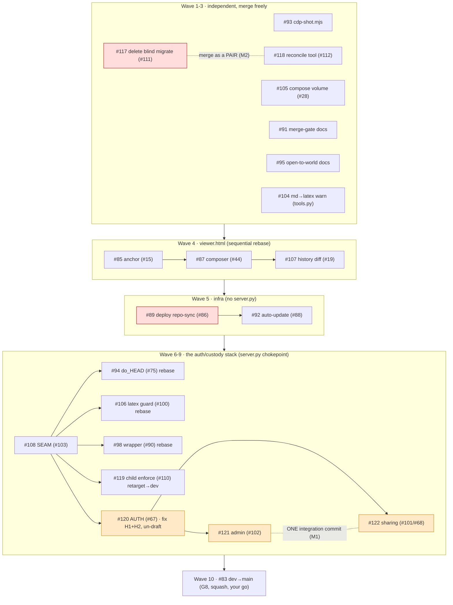

# PR merge plan — 21 open PRs (2026-07-24)

Plan only; **no merges happen until the owner says go.** Ordered by dependency (stacks), collision
(shared files), and the overnight security gates. Derived from the file-overlap audit +
`night-run-2026-07-23-decision-log.md` (Phase 4 security findings).

## The map

## Wave order + per-PR action

**Wave 1 — merge now, zero conflict** (touch nothing else):
- `#93` CDP helper · `#105` compose volume (#28). Merge, done.

**Wave 2 — custody prevention pair (M2: merge together)**:
- `#117` delete blind migrate (#111, **P0**) **+** `#118` reconcile tool (#112). Merge as a pair so the
  blind tool's deletion and its sanctioned replacement land in the same step. Low collision.

**Wave 3 — docs, low risk**:
- `#91` merge-gate convention · `#95` open-to-world · `#104` md→latex warning. `#104` edits `tools.py`;
  merge it before Wave 6's `#98`/`#106` so they rebase on top.

**Wave 4 — `viewer.html` sequence (rebase each on the prior)**:
- `#85` (#15) → `#87` (#44) → `#107` (#19). Three parallel edits to one file; merge in this order,
  rebasing each.

**Wave 5 — infra (no `server.py`)**:
- `#89` deploy repo-sync (#86, **P0**) → `#92` auto-update (#88). `#89`+`#120` both edit
  `docker-compose.prod.yml`; `#89` lands first, `#120` rebases in Wave 8.

**Wave 6 — the seam, then rebase the `server.py` touchers**:
- `#108` SEAM (#103) → **dev FIRST** (it refactors `_principal`/`_authz`; it is the base of the stack).
  Verified sound overnight, but review-before-merge.
- Then **rebase onto the refactored `server.py` and merge:** `#94` do_HEAD (#75) · `#106` latex guard
  (#100) · `#98` wrapper (#90). Not automatic, their `server.py` edits must adapt to the new structure.

**Wave 7 — custody on the seam**:
- `#119` child-resource enforcement (#110). Retarget base `refactor/103…` → `dev`, rebase, merge.

**Wave 8 — AUTH (security-gated)**:
- `#120` native auth (#67). **Prerequisites before merge:** fix **H1** (pin owner to a verified
  `MDREVIEW_OWNER_EMAIL`, kill the first-registrant-is-owner takeover), fix **H2** (don't hard-wire the
  stub email sender; select from config + fail-closed), resolve the `#89` compose collision, then
  **un-draft**, retarget → `dev`, rebase, merge. Highest-scrutiny PR.

**Wave 9 — sharing + admin (integration)**:
- `#121` admin (#102) **+** `#122` sharing (#101/#68). **M1:** they edit `hosted/custody.py` +
  `access.py` on parallel branches; land **ONE integration commit** composing all three policy arms
  (owner-only writes · public/named share reads+comment · audited admin super-read) so no control is
  silently dropped. Retarget → `dev`, merge the integrated set. `#122` also rebases on Wave 4's viewer.

**Wave 10 — G8 (your explicit go)**:
- `#83` dev→main. **Squash-merge in the GitHub UI** (main requires signed commits; squash is the only
  passing strategy for the unsigned agent commits).

## Gates that need *you* (not mechanical)
1. **Security fixes for #120** (H1 owner-pin, H2 stub-email) — I can implement on your go; they change auth behavior, so bless the approach first.
2. **The #121/#122 integration commit** (M1) — composes security controls; do it under review.
3. **Un-drafting #120** — after H1/H2.
4. **G8 on #83** — your call, and only after the stack is on dev.
5. Each PR is `review-before-merge` for the access-control ones (#108/#119/#120/#121/#122).

## Execution log (live — updated as each wave lands)

Legend: ✅ merged · 🔁 rebased+merged · ⏳ in progress · ⛔ gated (owner) · ⬜ pending

| Wave | PR | Status |
|---|---|---|
| 1 | #93, #105 | ✅ merged |
| 2 | #117 + #118 | ✅ merged |
| 3 | #91, #95, #104 | ✅ merged |
| 4 | #85 → #87 → #107 | ✅ merged (auto, no conflict) |
| 5 | #89 → #92 | ✅ #89 merged; #92 rebased (RUNBOOK union) → **re-created as #123 and merged** (accidental branch-delete auto-closed #92; recovered from local object + fresh PR) |
| 6 | #108 seam; then #94, #106, #98 | ✅ #108 merged (merge-commit); #94→**#124**, #106→**#125**, #98→**#126** (clean-from-dev re-PRs; GitHub mergeability cache got stuck on the force-pushed originals, so each was rebased onto dev + re-PR'd) |
| 7 | #119 | ✅ →**#127** (rebased onto post-seam dev) |
| — | **dev verified** | ✅ all compile · access-seam oracle PASS (byte-identical both tiers, hosted fails closed) · migrate.py deleted · do_HEAD/latexguard/reconcile present |
| 8 | #120 (auth) | ✅ H1 owner-pin + H2 email-fail-closed applied → **#128** (adversarial re-review CLEAN); #120 closed |
| 9 | #121 + #122 | ✅ composed into ONE CustodyPolicy (reads widen to shares+audited-admin-super-read; **writes/deletes stay owner-only**) → **#129**; re-review CLEAN, no control dropped; #121/#122 closed |
| — | **dev final** | ✅ whole cluster compiles + access-seam oracle PASS + all hosted modules present + migrate.py deleted |
| 10 | #83 dev→main | ⛔ G8 — owner's explicit call, squash-merge. **NOTE: merging does NOT activate anything in prod** (features are dormant until the entrypoint is switched to `python -m mdreview.hosted` + `MDREVIEW_OWNER_EMAIL` + an email sender — fails closed without them). |

## What I can do mechanically on your go
Waves 1-7 (the isolated + seam + rebases) and the retargets/rebases of the stacked PRs — conflict-free
once ordered as above. Waves 8-9 need the security fixes + integration commit first (your gates).
