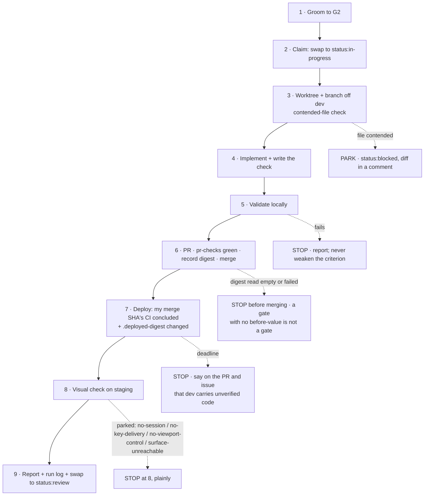

# Autonomous runs

How an agent executes scoped work unattended: preconditions, stages with exit criteria, hard
rules, and what to do when a stage fails. Live document, amended from run logs.

Plan of record: mdreview review `17731f7815` (critic gate closed 2026-07-27, 3 rounds).

## Why this exists

The 2026-07-25 night run shipped eight tickets and recorded five own-goals. Every one was a
process failure, not a coding failure: the run assumed a daemon that does not exist and lost
15 hours; two agents were launched into one worktree; a shared harness killed a sibling's
server by process name; a brief asserted a mechanism nobody checked; probes read an
async-rendering page too early and returned false negatives.

Reviewing the plan for *this* document added two more of the same family. The reviewer and the
author both read a CI workflow from a working tree 14 commits behind `dev`, reached the same
wrong conclusion, and the agreement looked like corroboration. Then the author specified a CI
fix (`pull_request` on a single job) that GitHub Actions cannot express, written from memory
instead of from the schema. Rule 8 exists because of those two.

## When to use it

For **scoped, already-identified work executed with no human between steps**. Not for
exploration, not for anything touching production data, not for a decision the owner has not
already made. If a stage needs a judgement the plan did not anticipate, the run stops and
reports; it does not decide.

## Preconditions

Checked before stage 1. Each has a command that actually runs.

| # | Precondition | Check |
|---|---|---|
| P1 | The run's tickets are identified and every dependency is closed. `status:ready` is **stage 1's exit criterion**, not a precondition — grooming is inside the run | `gh issue view <N> --json labels,body` |
| P2 | A driver exists: `/loop` is running, or the run is a single in-session pass | **There is no daemon.** An agent executes only when a message arrives |
| P3 | Each agent has its own git worktree | `isolation: "worktree"` on the Agent call |
| P4 | Staging's timer is live and the host's `auto-update.sh` carries the #163 fix | `ssh kapture 'systemctl is-active mdreview-staging-autoupdate.timer; grep -c repo_digest ~/mdreview-staging/auto-update.sh'` |
| P5 | Stage 8 has a route to a signed-in staging session **as the identity that owns the fixture** | Staging sets `MDREVIEW_ALLOW_STUB_EMAIL=1`: magic links are logged, not delivered. Read the link from `ssh kapture 'docker logs mdreview-staging'` |
| P6 | Every claim about CI, images or deploy is read from `origin/dev` | `git show origin/dev:<path>` — never the working tree |

P4 needs full `ssh kapture`. The restricted `kapture-agent` account answers `refused: not an
allowed command` for anything outside its verb list, and its `health` verb reports containers
and loopback probes only — nothing about the timer, the installed script, or the last adoption
attempt.

A precondition that **fails** stops the run. A precondition that **cannot be evaluated** also
stops the run: unevaluable is not the same as true, and assuming it is, is own-goal 4.

**P5 carries an accepted risk, restated here rather than inherited silently:** anyone who can
read the staging container log can complete a login as any email on staging. This is already
recorded in `docker-compose.staging.yml`; a process that institutionalises the practice should
say so out loud.

## Stages



| Stage | Exit criterion |
|---|---|
| 1 Groom | Body has checkable AC, deps, size, layer, priority; label `status:ready` |
| 2 Claim | **Swap** the status label to `status:in-progress` — exactly one `status:` label, always; one ticket at a time per agent |
| 3 Branch | Worktree created; branch `<kind>/<issue>-slug` cut from **current** `dev`; every file to be touched diffed against `origin/dev` first |
| 4 Implement | The change, **plus one runnable check** that fails if the logic breaks |
| 5 Validate | `py_compile` for svc; `tests/render-smoke.sh <url> <selector>` for ui — a 200 is not a render; the new check passes |
| 6 PR + merge | PR references `(#N)`, no auto-close keywords; `pr-checks` green; the host's `.deployed-digest` **recorded before merging**; then merge. An **empty or failed** digest read is a failed precondition, not a zero: **stop before merging** |
| 7 Deploy | The CI run for **your** merge SHA concluded successfully, **and** `.deployed-digest` differs from the recorded pre-merge value |
| 8 Visual | A screenshot of the changed surface on staging **with the interaction exercised**, signed in as the identity that owns the fixture |
| 9 Report | Issue comment (what changed, what was validated, what was **not**), **swap** to `status:review`, run log committed |

Stage 7 needs both halves. A 200 is not a deploy, and a digest change on its own is not *your*
deploy: a sibling agent's merge moves the same marker.

## Hard rules

1. **`/loop` drives it.** Intent is not a scheduler.
2. **One worktree per agent.** A worktree has one checked-out branch; two agents in one clobber
   each other.
3. **Kill by PID file, never `pkill -f <name>`.** Name-matching kills siblings on other ports.
4. **A 200 is not a render, and a 200 is not a deploy.** Every gate compares against a value
   recorded *before* the change, and attributes the change to *your* commit.
5. **Measure twice on async pages.** `viewer.html` and `latex-viewer.html` render through
   `marked` plus `setTimeout` fallbacks, so anything read immediately after load sees a
   half-built DOM. Settle explicitly, and dispatch a real `resize` event when testing width
   behaviour.
6. **Never weaken an acceptance criterion to make a ticket green.** If it cannot pass, that is
   a finding: file it as its own issue and report.
7. **Never fake a verification.** A screenshot of a different surface, a local check
   substituted for a staging check, or a criterion reworded after the fact are the same failure.
8. **A mechanism claimed in a plan, brief or process doc is a hypothesis.** Check it before
   reasoning from it — including the schema of a config file you are proposing to edit. Cite
   code by **symbol, not line number**, and read CI/deploy facts from `origin/dev`. Two readers
   agreeing off the same stale file is not corroboration.
9. **Park, do not clobber.** If a file you need has moved on `origin/dev` since you planned,
   stop at `status:blocked` with the diff in a comment. Losing one ticket is cheaper than
   silently overwriting work you never read.
10. **Stop at G4.** The run swaps to `status:review`. It never closes an issue (G5) and never
    touches `main` (G8).

## Stage 8: real input, and what to do when it will not arrive

Stage 8 is the **claude-in-chrome extension only**. Never headless, never a synthetic event.

That ban has a permitted half (#243): **a headless/CDP check is legitimate as the stage-4 runnable
check and never as stage-8 evidence.** This repo's own runnable checks are headless CDP
(`tests/palette_fullscreen_selfcheck.sh`, `tests/dashboard_narrow_selfcheck.sh`,
`tests/css_tokens_selfcheck.js`), and that is the intended split: stage 4 asserts the rendered
outcome mechanically and repeatably; stage 8 proves a real user's input reaches the real surface.

**A constructed `KeyboardEvent` is never acceptable as stage-8 evidence.** #222 is the case that
settled it: real Chrome sends `{key:"/", code:"Slash", shiftKey:true}` for `?`, while the unit and
CDP checks *constructed* an event with `key:"?"`. The feature was broken and every check stayed
green. A dispatched event proves your dispatcher works. It proves nothing about the browser.

### The route that delivers a real key press

Measured 2026-07-29 across nine attempts. Key delivery is **not** simply available or unavailable:
it depends on the shape of the call.

```
1. navigate to the page          <- its OWN call, NOT inside the batch
2. ONE browser_batch containing, in order:
     javascript_exec   arm a capture-phase keydown logger on window
     left_click        anywhere harmless on the page
     key               a throwaway press (an invalid name like "slash" is ideal: it is a no-op)
     key               THE KEY UNDER TEST
     javascript_exec   read the logger AND the app's own state
```

**This shape is necessary but NOT sufficient.** It was reproduced 4/4 inside one window during
one burst, and then failed twice in a row, in a fresh default-sized window, following the same
recipe exactly. From the agent's side delivery therefore looks **intermittent**. An earlier
version of this paragraph added "and the trigger is not understood"; the confirmation below
superseded that the same day, and the stale half stood until #299 removed it (sprint-38 G7,
DEV-3). The trigger is understood, and it is the next paragraph.

**Confirmed 2026-07-29: the key goes to whichever window the OS considers frontmost.** Three
consecutive attempts delivered zero events while the owner was working in another app. The owner
then used Chrome directly, and the very next attempt — same recipe, same window, same tab —
delivered the key and opened the palette. That is the whole variable.

An agent can neither set nor read that state: `document.hasFocus()` returned `true` on all three
zero-event attempts, so it is worthless as a signal. **The only reliable tell is the logger**: if
the page saw no `keydown`, Chrome was not frontmost, whatever any API claims.

Practical consequence: **keyboard criteria are verifiable whenever the owner is at the machine
with Chrome in front, and not otherwise.** So the ask is small and specific — "bring Chrome to the
front and say so" — rather than "the tool cannot do this".

**Therefore: treat a zero-event reading as ordinary, not as breakage.** Attempt the route up to
three times. If the logger still shows nothing, Chrome is almost certainly not frontmost: park with
`no-key-delivery` and ask the owner to bring the window forward, then retry immediately. Do not
conclude "the tool cannot do this"; it demonstrably can, under a precondition you cannot set
yourself.

Every one of these variations delivered **zero** events even during the burst, so the shape above
still matters:

| Variation | Result |
|---|---|
| Each action as its own tool call | 0 events |
| `navigate` inside the same batch | 0 events |
| Click + a single key (no throwaway) | 0 events |
| Two keys, no click | 0 events |
| Any window at a non-default size (resized, or size-inherited) | 0 events |

**Read the logger, not the tool's success report.** `key` reports "Pressed 1 key" whether or not
the page ever saw it. The only evidence is a `keydown` observed *in the page*, plus the app state
the key was supposed to change.

### The route that produces a specified viewport width

```
1. close EVERY tab in the group   (the group auto-removes when the last one goes)
2. tabs_context_mcp createIfEmpty  -> a fresh window
3. resize_window                   -> BEFORE any navigation
4. navigate
5. read window.innerWidth IN THE PAGE and assert it
```

Demonstrated 2026-07-29: requested 1180, measured `window.innerWidth` **1180 exactly** — on the
second attempt. Also measured this way: 606 (the narrow floor), 1280, 1400.

**Attempt one landed in a maximised window and reported 1512.** That is the common failure, and the
recovery is to close the tab, recreate the group, and repeat. Budget two attempts, not one.

| Trap | What you see | Why |
|---|---|---|
| Maximised window | Resize "succeeds", page reads 1512 | The fresh group landed in a maximised window; close and recreate |
| Already navigated | Resize "succeeds", width unchanged | `resize_window` silently no-ops after navigation. Resize FIRST |
| Size inheritance | A brand-new tab is already 606 | New tabs inherit the previous window's size; it is not a fresh default |
| Requested != actual | Asked 380, got 606 | The OS enforces a minimum window width. **606 is the floor on this display** |

**The requested width is a request. The measured `innerWidth` is the fact.** Never record the
number you asked for; record the number the page reported, and if they differ, the page wins.

### The unresolved half: viewport AND keys together

**A specified viewport width and real key delivery have never been obtained in the same window.**
That is a fact. The *reason* is not established, and an earlier version of this section asserted
one it could not support.

The tempting reading was "narrow windows refuse keys". It is **confounded**: every narrow-window
key attempt so far happened while Chrome was not frontmost, which independently explains zero
events. The two candidate causes have never been separated.

**The experiment that settles it, one line of owner time:** open a resized window, ask the owner to
bring Chrome to the front, then run the key route. Keys landing means width was never the variable
and narrow-width keyboard criteria are fully verifiable. Keys still absent means width is a real
second constraint.

Until then, do not verify the two halves separately and imply one run. State which half you
measured, in which window, and that the combination is untested.

### Park procedure — a negative result is a pass, an unrecorded park is not

When real input cannot be delivered, **park**. Do not fake it, do not fall back to headless, and
do not let "we documented the problem" stand in for "we fixed the problem".

1. Leave the ticket at its true state. It has not earned `status:review`.
2. Comment on the issue: which criteria are verified, which are parked, the **measured** evidence
   for the park (the zero-event reading, not a narrative), and what a human needs to do instead.
3. State the residue explicitly. Anything a keyboard cannot reach is ~30 seconds of owner typing;
   ask for it in one line.
4. Record it in the run log as an error entry, with what would falsify the diagnosis.

**"I tried and it did not work" is a statement about your approach, not about the tool.** It has
been wrong twice: the viewport claim on 2026-07-28 (a new window then resize gave the exact width)
and the key-delivery claim on 2026-07-29 (batching delivered the key). Before writing off a
capability, vary the *shape* of the call, not just the parameters.

### Stage-8 park reasons — the shared taxonomy

One list, so #243 and #254 cannot invent competing vocabularies. Record exactly one:

| Reason | Means | Residue |
|---|---|---|
| `no-session` | No signed-in staging session as the fixture's owner | Owner signs in, or P5's stub-email route is repaired |
| `no-key-delivery` | Real key presses do not reach the page | Owner types it, ~30 seconds |
| `no-viewport-control` | The required width cannot be produced in a real window | Owner resizes and looks |
| `surface-unreachable` | The surface cannot be brought on screen at all | Depends; state it |

## Failure protocol

Stop, record what failed with its evidence, leave the ticket at its true state, report.

Three attempts is the ceiling for a **retryable action**. **Waiting stages get a wall clock
instead**, because a poll with no bound never reaches this section at all. Stage 7's clock
starts when the CI run for your merge SHA concludes — not at merge — and expires after two
timer cycles (~30 min) with no digest change. Baseline observed 2026-07-27: 67-second image
build, ~11 minutes from merge to adoption.

**An empty or failed `.deployed-digest` read at stage 6 stops the run BEFORE the merge.** The
observable is exact: the read produced an **empty string**, or the command exited **non-zero**.
Neither is a value. Do not treat an empty read as "unchanged", do not merge and re-read afterwards,
and do not substitute a value read after the merge — by then the timer may already have moved the
marker, and stage 7 would be comparing your deploy against itself.

This is the **Preconditions** rule applied to a stage: *"A precondition that **fails** stops the
run. A precondition that **cannot be evaluated** also stops the run: unevaluable is not the same as
true, and assuming it is, is own-goal 4."* A gate with no before-value is not a gate.

It has already happened once. On the 2026-07-27 run (#189, D9) the `ssh` read returned an empty
string and the merge proceeded anyway. It was recoverable only by luck: the marker was re-read
after merging but before the timer fired, and had not moved yet. Had the cycle landed first, stage
7 would have had nothing to compare against and the deploy would have been declared verified on no
evidence.

**If a run stops after stage 6 and before stage 7 completes, `dev` carries code that never
reached staging.** The stopping agent owes the next one a note on both the PR and the issue
saying exactly that, because the next branch cuts from that `dev`.

## Run log

`docs/process/runs/<YYYY-MM-DD>-<slug>.md`, committed with the work. One entry per decision:
what was decided, why, and **what would falsify it**. Own errors recorded explicitly — that is
the part that pays for the document.
