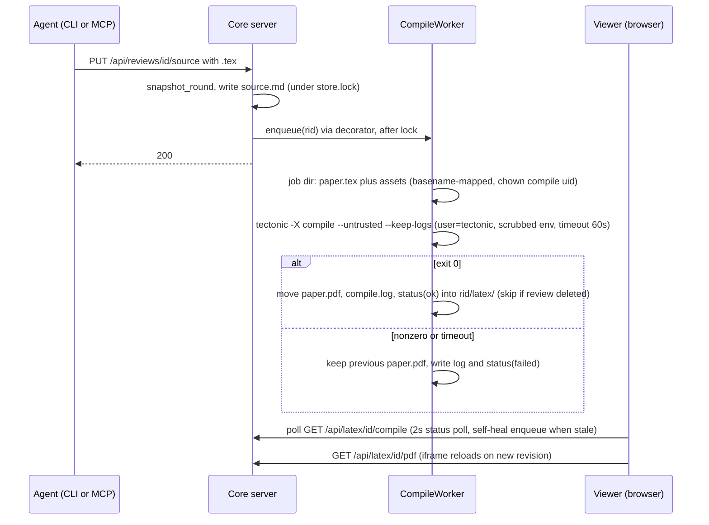

# LaTeX Paper Review Mode Plan

An opt-in `latex` review kind: an Overleaf-style split viewer (LaTeX source, line-numbered and
highlighted, on the left; a live server-compiled PDF on the right) for reviewing research papers,
reusing the existing review store, comment system, and MCP loop. Planned, critic-gated, and
owner-approved on hosted mdreview review `9215476104` (2026-07-21); this file is the committed
record of the approved plan (review revision 10). UI contract: the approved interactive mockup
(artifact `b1132f25-daf3-43d8-ba92-d41655fb68d4`).

**Source requirement:** [`requirements/latex-paper-review.md`](../requirements/latex-paper-review.md),
kept verbatim.

## Product goal

A researcher pushes a `.tex` draft through the same agent loop used for markdown reviews, opens
`/review/{id}`, sees source and compiled PDF side by side, comments exactly as they do today
(select text or click a line), downloads the PDF when they want it, and then tells the agent in
the CLI to collect feedback. Current app behavior is untouched when the feature flag is off.

## Core design principle

**The core app must be byte-identical when the flag is off, and the feature must be deletable:**
removing `src/latex_review/`, `web/app/latex-viewer.html`, and `infra/Dockerfile.latex` with the
flag off must leave a working tree where nothing dangles except the five flag-gated/additive core
edits enumerated below.

## Recommended approach

### The IoC seam and the `kind` field (the only core changes, all five enumerated)

Grounded in the current code: routing is a single if-chain in `H.route(m)`
(`src/mdreview/server.py:224-557`, first match wins, JSON 404 fallthrough at 557); composition
happens in `Services.__init__` (server.py:49-60) and `main()` (server.py:560-563); handlers reach
services via `self.server.app`. Config is import-time env reads in `src/mdreview/config.py`.

Core gains exactly five edits: three for the seam, two for `kind` plumbing.

**Seam (flag-gated):**

1. `config.py`: one flag line, same pattern as `REQUIRE_AUTH` (config.py:20):
   `ENABLE_LATEX = os.environ.get("MDREVIEW_ENABLE_LATEX", "").lower() in ("1", "true", "yes")`
2. `Services.__init__`: a `self.modules = []` list; when `config.ENABLE_LATEX` is true, import
   `latex_review` (conditional import, inside the if) and append its module object. The module
   receives the services it needs (store, reviews, comments) as constructor args: dependency
   injection, core never reaches into the package.
3. `H.route(m)`: one dispatch loop after the trailing-slash/MAX_BODY guards (server.py:227-231)
   and before the first core arm:

   ```python
   for mod in self.server.app.modules:
       if mod.handle(self, m, path):
           return
   ```

Flag off: `modules` is empty, the loop is a no-op. Flag on: the module claims only (a) its own
`/api/latex/...` namespace and (b) `GET /review/{rid}` **when that review's meta has
`kind == "latex"`**, so markdown reviews fall through to core untouched. Dispatch-before-core-arms
is what lets the canonical `/review/{id}` URL serve the right page per kind with zero changes to
the dashboard link or the `review_url` returned by create.

**`kind` plumbing (flag-agnostic, additive):**

4. The `POST /api/reviews` arm reads an optional `kind` field (validated to
   `{"markdown","latex"}`, 400 otherwise).
5. `ReviewService.create` gains an optional `kind` parameter and **persists it in meta.json only
   when `kind != "markdown"`**. No default key is ever written: markdown reviews' meta.json stays
   byte-identical to today.

The only-when-latex rule is load-bearing, not cosmetic: `summary()` returns `dict(meta)` plus
derived fields **unwhitelisted** (reviews.py:54), and both `GET /api/reviews/{id}` (server.py:331)
and the list endpoint (server.py:286-293) echo it verbatim. Writing a default `kind="markdown"`
would add a key the old image never emitted and fail the golden-transcript oracle in Key
constraints. The other read surfaces are safe (`get_status` whitelists its 7 output fields,
migrate touches only `owner`, dashboard `card()` reads named props only). Readers use
`meta.get("kind", "markdown")`. With the flag off and `kind=latex` passed anyway, the review is
created with the field but served by the markdown viewer and never compiled: harmless, documented.

### The module: `src/latex_review/`

```
src/latex_review/
  __init__.py      build(store, reviews, comments) -> LatexModule
  module.py        LatexModule: route claims + handlers (pages, PDF, compile status)
  compiler.py      CompileWorker: queue + Tectonic subprocess + status/log persistence
  decorator.py     LatexAwareReviews: wraps ReviewService, triggers compile on create/put_source
```

- **`module.py`** handles, all behind the same auth contract as core (`h._authz(rid)` first,
  404-not-403 for foreign reviews, `_disk_low()` before writes):
  - `GET /review/{rid}` where `kind == "latex"`: serves `web/app/latex-viewer.html`.
  - `GET /api/latex/{rid}/pdf`: latest compiled PDF, `Content-Type: application/pdf`, served
    inline (the iframe consumes it). The viewer's Download button is an HTML5 `download`
    attribute on a same-origin anchor; no `Content-Disposition` header, deliberately, because the
    core `_send` helper (server.py:76-88) has a fixed header set and this avoids bypassing it.
  - `GET /api/latex/{rid}/compile`: `{state: queued|running|ok|failed, revision, finished_at,
    log_tail}` from `status.json`.
  - **Self-heal (compile-on-demand):** on `GET .../pdf` or `.../compile`, if the review is
    `kind == "latex"` and there is no `status.json`, or `status.revision` trails the meta revision
    with nothing queued or running, the module enqueues a compile. Covers the two orphan states: a
    review created while the flag was off and served later by a flag-on image, and a pending job
    lost to a container recreate (the queue is in-memory by design).
- **`compiler.py`**: a single worker thread draining a `queue.Queue` of review ids with per-rid
  coalescing (a rid already queued is not enqueued twice; a compile for a rid that gets another
  update is followed by exactly one more). Each job: create a fresh empty job dir **chowned to the
  dedicated compile uid**; write `source.md`'s content as `paper.tex`; copy in each manifest asset
  **as the basename of its manifest `name`** (stored files are sha1-named, so the worker maps sha
  file to human name; any `name` containing a path separator, leading `/`, or `..` segment is
  flattened to its basename, closing the write-side traversal); run Tectonic **as the unprivileged
  compile user with a scrubbed environment** (`subprocess.run(..., user="tectonic",
  env=MINIMAL_ENV)`, Python 3.9+ `user=` works because the server runs as root); then the worker
  (root) atomically moves `paper.pdf` + `compile.log` + `status.json` into `<data>/<rid>/latex/`.
  **Before the final move the worker re-checks the review dir still exists and skips the move if
  it vanished** (a DELETE can rmtree the review under `store.lock` while a compile is in flight).
  Only the latest PDF is kept. `snapshot_round` provably never touches sibling dirs
  (reviews.py:82-106), so history stays intact.
- **`decorator.py`**: registered in the composition root when the flag is on:
  `app.reviews = LatexAwareReviews(app.reviews, worker)`. `create`/`put_source` delegate to the
  wrapped service unchanged, then enqueue a compile iff `kind == "latex"`. Enqueue is O(1) and
  lock-safe: the compile itself runs on the worker thread, never under `store.lock`.

### Compile pipeline (Tectonic)



Grounded Tectonic facts (verified 2026-07-21 against releases and docs; current stable 0.16.9,
released 2026-04-17):

- Static musl binaries exist for x86_64 and aarch64. No apt package; the release tarball is the
  standard Docker install.
- `--untrusted` disables known-insecure features; shell-escape is off by default; belt-and-braces
  `ENV TECTONIC_UNTRUSTED_MODE=1` in the image so a later CLI arg cannot re-enable.
- Packages download on first use into the cache (`TECTONIC_CACHE_DIR`); **pre-warm at image
  build** by compiling a representative preamble (amsmath, amssymb, natbib, graphicx, hyperref,
  booktabs, xcolor), so typical compiles are fast/offline. **Amendment (owner, 2026-07-21): the
  compile does NOT use `--only-cached`** (it failed on any unwarmed resource); Tectonic may fetch
  missing packages from its bundle CDN at compile time, its only egress. Warmed cache is
  tens of MB. The baked cache is world-readable so the unprivileged compile user can read it.
- bibtex/natbib runs automatically (capped at 6 reruns). **biblatex/biber is NOT integrated**:
  named non-goal. Engine is XeTeX-based: pdflatex-only primitives differ; named limitation.
- Failure = nonzero exit; `--keep-logs` preserves the `.log`, which becomes `compile.log` and the
  viewer's error surface.

**Compile failure UX:** the viewer keeps showing the last good PDF with a red banner "Compile
failed at v(N), showing v(N-1)" and a collapsible log tail; if no PDF has ever built, the PDF pane
shows the log instead (the self-heal guarantees a compile attempt exists to produce one). The PDF
is never silently stale: the compile-status endpoint reports which revision the PDF was built
from, and the banner states it.

### Viewer page (`web/app/latex-viewer.html`)

Self-contained (inline CSS/JS, the repo's page convention), implementing the approved mockup: same
theme tokens as viewer.html, split panes with draggable divider, line-numbered source pane,
comment rail, PDF via `<iframe src="/api/latex/{id}/pdf">` (browser-native PDF rendering),
Download button (HTML5 `download` attribute), Source/PDF tabs under 880px.

- Reuses the existing HTTP API verbatim: `GET /source`, `GET /status` (2s poll: `source_updated`
  change reloads source AND checks compile status; `comments_updated` change refetches comments),
  comments CRUD (`POST /comments` with `{anchor:{quoted_text, block_num, start:null, end:null},
  text}`, reply, reopen, delete).
- `block_num` is stored verbatim as an opaque string (comments.py:69, never interpreted
  server-side), so **line numbers need zero server/comment-store changes**. The page renders each
  source line as an element carrying `data-num="<line>"`, with the `has-comment` margin treatment
  and the same untrusted-comment sanitization as the viewer (escape, then marked, then href/src
  stripping).
- **Quoted-text highlighting, adapted rather than copied:** the markdown viewer's fallback scan
  does `indexOf` within a single text node (viewer.html:645-648), which breaks once a line is
  span-tokenized for syntax color. The latex page therefore searches each line's concatenated
  `textContent` for the quote and maps the match offset back to a DOM Range across the line's
  child text nodes before wrapping the `<mark>` (wrapping per intersected text segment, since a
  Range spanning element boundaries cannot be surroundContents'd). Exact `block_num` (line) lookup
  remains the first step; the textContent search is the fallback for agent comments with a missing
  or wrong line.
- Syntax highlighting: hand-rolled small tokenizer (commands, comments, math), same classes as the
  mockup. NOT hljs unless the vendored `highlight.min.js` build already ships `latex` support
  (checked at MR-097); either way no new vendored dependency.
- No turn banner, no send/reclaim controls, no handoff calls. Turn state defaults to `reviewer`
  forever on never-handed-off reviews (reviews.py:65), which is exactly right for pull-based flow.

### Dashboard (`web/app/dashboard.html`, the only core UI file changed)

- A `LATEX` chip in the card crumb row when `r.kind == "latex"` (field only present on latex
  reviews, so the guard is presence).
- `statusOf(r)`: a `kind == "latex"` branch showing open-comment count instead of the
  baton-centric "Your turn" badge (otherwise every latex review shows "Your turn" forever).
- The card link stays `/review/{id}` for both kinds (the seam serves the right page).

### MCP (`src/mcp/`)

- `client.py:56`: add `"kind"` to the create_review body whitelist tuple (the route builder
  silently drops unknown args today, so without this the param cannot pass).
- `tools.py`: add optional `kind` to create_review's inputSchema, plus wording in INSTRUCTIONS
  **and in the `update_source`/`get_source` descriptions**: for a `kind="latex"` review the source
  is raw LaTeX end-to-end, and the markdown authoring rule does not apply. Bumps `tools_hash`,
  correctly signaling staleness.
- **Operational cost, named:** editing the MCP layer requires every connected stdio client to
  reconnect. All MCP edits land in one ticket (MR-099) so there is exactly one reconnect event.
- `hand_back`/`ping_working` on a latex review: callable but meaningless. v1 policy: leave server
  behavior as-is, document "not applicable to latex reviews"; no server-side rejection (YAGNI).

### Infra (separate image, slim path untouched)

- **`infra/Dockerfile.latex`** (follows the `Dockerfile.watcher` second-Dockerfile precedent):
  `FROM python:3.12-slim`, same COPYs as the main Dockerfile, plus the pinned Tectonic musl
  tarball (version + sha256), pre-warmed world-readable bundle cache, `ENV
  TECTONIC_UNTRUSTED_MODE=1 MDREVIEW_ENABLE_LATEX=1 TECTONIC_CACHE_DIR=/opt/tectonic-cache`, a
  dedicated unprivileged `tectonic` user (server stays root as today), and `chmod 700 /data`. The
  runbook (MR-100) notes a one-time `chmod 700 /data` for pre-existing volumes.
- **amd64-only for v1**, matching the watcher precedent (release.yml:59): the pre-warm step
  executes Tectonic at build time and QEMU-emulating that on the arm64 leg is the exact tax the
  watcher avoided. arm64 deferred until a real arm64 target exists.
- **`release.yml`**: one mirrored build-push step publishing
  `ghcr.io/<owner>/mdreview-service-latex:{VERSION,latest}` (separate package, so the hosted prod
  compose pinning `mdreview-service:latest` can never silently fatten).
- **Stdlib-only constraint, addressed head-on:** the Python runtime stays stdlib-only (Tectonic is
  a system binary invoked via `subprocess`, no pip). The repo's "stdlib-only micro-service" claim
  gains one sentence: the opt-in latex image adds a system binary; the default image does not.

## Security posture (untrusted LaTeX)

- `--untrusted` + `TECTONIC_UNTRUSTED_MODE=1`: shell-escape and known-insecure features off,
  cannot be re-enabled per-invocation. No code execution.
- Network (owner amendment 2026-07-21): NOT `--only-cached`. The compile may fetch missing
  resources from Tectonic's bundle CDN (its only egress; the document cannot direct it elsewhere,
  so no document-controlled SSRF). `--only-cached` was dropped because it hard-failed on any
  unwarmed font/package; the build-time warm cache keeps the common case fast/offline. Lock egress
  to the bundle host at the container level for zero-trust.
- Fresh empty job dir per compile; 60s subprocess timeout; `_disk_low()` check before enqueueing;
  compile output size cap (~50 MB).
- **Write-side traversal, closed by construction:** asset copy-in maps every manifest `name` to
  `basename(name)` and flattens any name containing a separator, leading `/`, or `..` segment.
  Consequence, accepted: subdirectory figure references cannot resolve in v1; figures are
  referenced by bare filename. Two assets sharing a basename collide in the job dir; documented as
  part of the same v1 scope.
- **Read-side hardening (closes the two paths that mattered):** Tectonic has no filesystem sandbox
  (a document can `\input` files by absolute path, upstream issue #8). The two dangerous targets
  in this container were `/proc/self/environ` (would have inherited `MDREVIEW_PROXY_SECRET` and
  `MDREVIEW_TOKEN_PEPPER`) and `/data` (every user's reviews). Both are closed: (1) **scrubbed
  environment**, the worker spawns Tectonic with a minimal env, so `/proc/self/environ` of the
  compile process contains no secrets; (2) **unprivileged compile uid** with `/data` at mode 0700
  root-only, so the compile process physically cannot read review data or any root-owned file.
- **Accepted residual (owner, 2026-07-21):** a malicious paper can still `\input` world-readable
  container files (e.g. `/etc/passwd`, the app's own source) into its own PDF. Combined with the
  authenticated-users-only trust model, trivial. A full sandbox stays deferred unless the instance
  ever accepts third-party papers.
- PDF endpoint respects `_authz` (owner-scoped, 404 for foreign).

## Rollout phases

Each phase independently shippable; the flag stays off in every published slim image throughout.

### Phase 1 — Core seam + kind (MR-092, MR-093)
Flag, modules list, dispatch loop, golden-transcript oracle; `kind` plumbing.

### Phase 2 — The latex module (MR-094, MR-095)
Routes + auth parity + self-heal; compiler worker + hardened subprocess + smoke.

### Phase 3 — Image (MR-096)
`Dockerfile.latex` + release step.

### Phase 4 — Surfaces (MR-097, MR-098, MR-099)
Viewer page per mockup; dashboard chip/status; MCP `kind` + wording.

### Phase 5 — Docs (MR-100)
Sweep: README, gate refs, runbook.

## Non-goals

- Multi-file TeX projects (single `.tex` + attached figure assets referenced by bare filename;
  `\input`/`\include` of a second source file and subdirectory figure paths are out of scope v1).
- In-browser LaTeX editing; the browser is a review surface, the agent edits via MCP.
- Turn baton / handoff machinery in this mode.
- biblatex/biber (bibtex/natbib works; biblatex is not integrated in Tectonic).
- pdflatex-exact fidelity (Tectonic is XeTeX-based).
- arm64 latex image (amd64-only v1, watcher precedent).
- Full compile sandbox (nsjail/read-only rootfs/separate container); scrubbed-env +
  unprivileged-uid is the v1 posture.
- Compile-on-hosted rollout: enabling app.mdreview.space is a separate op decision, only after the
  owner tests locally and approves.
- Removing the baton from the markdown viewer (separate backlog item).

## Key constraints

1. Flag off = byte-identical core behavior for existing markdown reviews: the API and the
   markdown viewer are byte-identical to baseline, proven by the golden-transcript oracle (23
   steps, diff empty). The dashboard page (`web/app/dashboard.html`) is the one product UI file the
   feature intentionally changes (3.5): its added chip/badge are additive and guarded on
   `kind==="latex"`, so a markdown-only dashboard renders identically (verified by
   `git diff <baseline> -- web/app/dashboard.html`); the oracle excludes its inert-for-markdown
   bytes rather than the raw-byte compare falsely flagging an intended change.
2. Core never imports `latex_review` at module level; the only import is inside the
   `ENABLE_LATEX` branch of the composition root.
3. Compiles never run under `store.lock`; enqueue only.
4. Every module route calls `_authz`/`_require_user` exactly like core arms; PDF serving is
   owner-scoped.
5. The Tectonic subprocess always runs as the unprivileged compile uid with the scrubbed env;
   never as root, never with the server's environment.
6. Validation per repo gates: `python3 -m py_compile src/mdreview/*.py src/mcp/*.py
   src/watcher/*.py src/latex_review/*.py src/mcp_server.py src/watch.py`; smokes run against a
   throwaway container on a scratch port with throwaway `MDREVIEW_DATA` under `.scratch/`, never
   compose (:8137) and never the live :8139 / `mdreview-data` volume.
7. Conventional commits with ticket IDs; docs updated in the same change or in MR-100 (named in
   each deferring ticket's Work log; sweep closes within sprint-29).

## Preferred execution order

1. MR-091 (this scaffolding) then MR-092, MR-093 (core seam + kind).
2. MR-094, MR-095 (module + compiler).
3. MR-096 (image) so end-to-end compile smokes can run.
4. MR-097, MR-098, MR-099 in any order (independent surfaces).
5. MR-100 last (docs sweep, same sprint).

## Ticket breakdown

| ID | Title | Layer | Phase |
|----|-------|-------|-------|
| MR-091 | Capture brief + epic plan + G1 record | docs | 0 |
| MR-092 | Core seam: flag, modules list, dispatch loop, golden-transcript oracle | svc | 1 |
| MR-093 | `kind` plumbing (persisted only when latex) | svc | 1 |
| MR-094 | `latex_review` package: routes, auth parity, self-heal | svc | 2 |
| MR-095 | Compiler: hardened Tectonic worker + `tests/latex_smoke.py` | svc | 2 |
| MR-096 | `Dockerfile.latex` + release step (amd64-only) | infra | 3 |
| MR-097 | `latex-viewer.html` per mockup + render-smoke selectors | ui | 4 |
| MR-098 | Dashboard: LATEX chip + kind-aware statusOf | ui | 4 |
| MR-099 | MCP: create_review `kind` + latex-aware tool wording | mcp/svc | 4 |
| MR-100 | Docs sweep: README, gate refs, runbook | docs | 5 |

## Risks and mitigations

| Risk | L | I | Mitigation |
|------|---|---|------------|
| Compile fails on valid-looking papers (package gaps vs pdflatex) | M | M | Warmed cache covers the standard paper preamble; error banner + log; non-goals name biblatex/XeTeX limits |
| Malicious .tex reads container files into PDF | L | L | `--untrusted`, no-network, empty job dir, scrubbed subprocess env, unprivileged compile uid + `/data` 0700; residual = world-readable files only, accepted |
| Compile queue starvation / DoS via rapid updates | L | M | Per-rid coalescing, single worker, 60s timeout, disk floor check |
| MCP reconnect friction | M | L | All MCP edits in one ticket, one reconnect; tools_hash bump signals it |
| hljs lacks latex in vendored build | M | L | Fallback tokenizer specced; decision at MR-097 |
| Dashboard/statusOf regression for markdown reviews | L | H | Chip and statusOf branch are `kind`-guarded; dashboard render-smoke at G7 |
| Orphan states (flag-off-created latex review, lost queue on recreate) | L | L | Compile-on-demand self-heal + delete-race move guard |
| Pre-existing volumes keep permissive /data perms | L | M | Runbook documents one-time `chmod 700 /data`; latex_smoke asserts the compile uid cannot read /data |
| Image size / build time growth | — | L | Separate `mdreview-service-latex` package, amd64-only, no QEMU warm-up |

## Verification (runnable, non-gameable)

```bash
# 1. Syntax gate (extended glob)
python3 -m py_compile src/mdreview/*.py src/mcp/*.py src/watcher/*.py src/latex_review/*.py src/mcp_server.py src/watch.py

# 2. Flag-off byte-identical oracle: same scripted request transcript against
#    baseline and new build; diff must be empty
bash tests/golden_transcript.sh http://localhost:<scratch-old> http://localhost:<scratch-new>

# 3. Import isolation: a flag-off import of the server must not load latex_review
#    (a sys.modules assertion, not a greppable-and-gameable source scan)
python3 -c "import sys; sys.path.insert(0,'src'); import mdreview.server; \
  assert 'latex_review' not in sys.modules"

# 4. Compile smoke (from the latex image, scratch port, throwaway data dir)
python3 tests/latex_smoke.py http://localhost:<scratch>

# 5. Render smoke on the new page (rebuilt latex image)
tests/render-smoke.sh http://localhost:<scratch>/review/<latex-rid> "#srcpane" "#pdfpane" ".gcard"

# 6. Auth: foreign-user PDF fetch on hosted-mode container returns 404

# 7. Traversal: attach an asset named "../evil.png", compile, assert nothing written outside the job dir

# 8. Hardening probe: compile a paper containing \input{/proc/self/environ} and
#    \input{/data/<other-rid>/source.md}; assert the PDF contains no MDREVIEW_* value
#    and the /data read fails (permission denied in compile.log)
```

## Decisions recorded (owner, 2026-07-21, on review 9215476104)

1. **Base branch:** consolidate `dev` first (fast-forwarded to main at `94671c1`), then cut
   `feat/latex-review` from `dev`. Standing PR targets `dev`; `dev` to `main` stays G8.
2. **Figures:** bare-filename-only asset references in v1; subdirectory paths unsupported.
3. **Hosted rollout:** later, only after the owner tests locally and approves; merges flag-off.
4. **Compile security:** accepted in hardened form (scrubbed env + unprivileged uid in scope);
   residual = world-readable container files only.
5. **Plan approved** by the owner on 2026-07-21 after a 2-round staff-critic gate (see review
   record).
