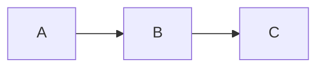

# Theme awareness in the review viewer — Plan

A figure authored for a light background (a PNG screenshot, a light-only SVG, an attached asset
from the rich-rendering epic) renders as a dark smear when the reviewer's OS is in dark mode and
the viewer pane themes dark. This is the dominant, reported case: **most figures are
light-authored** (opaque light backgrounds, or transparent with dark strokes), and on a dark pane
they smear into the dark column. The viewer pane, Mermaid, and KaTeX already adapt to
`prefers-color-scheme`; the gap is the **raster/SVG `` images** dropped into `#article`. This
epic gives those images a stable, predictable light surface so a light-authored figure never
renders as an unreadable smear, without regressing the prose, math, or diagram theming that
already works. It is a `viewer.html`-only change — no service, API, or MCP touch.

**One direction, stated honestly.** A light card fixes the common direction (light-authored figure
on a dark pane) and **does not** fix — and in one sub-case **regresses** — the inverse:
a *white-on-transparent / dark-authored* figure that is legible on today's dark pane becomes
invisible on the light card (measured: luminance spread 238 → 5, see the design fork). That
inverse case is **named out of scope** (Non-goals) and needs a per-image luminance heuristic, which
is a separate backlog effort. The plan does **not** claim a symmetric fix.

**Source requirement:** [`requirements/theme-awareness.md`](../requirements/theme-awareness.md) —
the original brief, kept verbatim.

## Product goal

A reviewer opening `/review/{id}` on a **dark** OS no longer sees **light-authored** figures —
the dominant case — render as an unreadable dark smear: each such embedded image (in the live
`#article` document and the version-history modal, see SHOULD-2 below) sits on a stable light card
and stays legible. On a **light** OS those same figures are unchanged (a light card on a light pane
is a no-op-to-paper seam). Prose, math, and Mermaid — which already adapt — render byte-for-byte as
they do today. A document with **no** images looks identical to today on both panes.

**What this goal does NOT claim (the honest boundary).** It does **not** fix the inverse direction:
a *dark-authored / white-on-transparent* figure, legible on today's dark pane, becomes invisible on
the light card (measured regression, luminance spread 238 → 5). That case is **out of scope** and
listed in Non-goals; it requires per-image luminance detection (backlog). The fixed direction is
the common one — most figures are light-authored — and the unfixed/regressed direction is rare.

## Core design principle

**Give images the one surface most of them assume — a light card — and leave everything that
already themes alone.** An `` is an opaque box: the viewer cannot know whether its contents
were drawn for light or dark, and (proven below) cannot push the pane's theme into an
``-loaded SVG. Without per-image content inspection there is no theme-symmetric fix; we pick
the **majority direction**. Most figures are light-authored, so rendering every image on a
consistent **neutral light card** with padding — the background a light figure assumes — fixes the
common smear regardless of pane theme.

This is an **asymmetric** choice with an honest cost: a *dark-authored / white-on-transparent*
figure, which is legible on today's dark pane, becomes invisible on the light card (the measured
regression below). We accept that minority regression in exchange for fixing the majority smear,
and we surface it — Non-goals names it, and a verification fixture **shows** it on the dark
screenshot so the product owner signs off on the tradeoff rather than discovering it post-ship. The
seam a light card creates on a dark pane (a paper-coloured inset in a dark column) is a deliberate,
legible choice, not a bug. The fix still **excludes** the surfaces that already theme themselves
(`.mermaid`, `.katex`), which are not `` and so never match the selector.

## The design fork — resolved

The brief offered (a) a neutral card vs (b) setting the host `color-scheme` so
`@media (prefers-color-scheme)` inside `` SVGs fires. **I verified (b) empirically and it does
not fix the reported bug. I recommend (a), surgically scoped to images.**

### Why (b) is rejected — measured, not assumed

I built a 200×60 SVG whose `<rect>` is red under the light rule and blue under
`@media (prefers-color-scheme: dark)`, loaded it via `` into a host page, and screenshotted
under headless Chrome 149 (`--screenshot`, sampling the rect's center pixel):

| Host page | `preferredColorScheme=1` (light) | `preferredColorScheme=0` (dark) |
|-----------|-----------|-----------|
| **no** `color-scheme` set | RED (light rule) | BLUE (dark rule) |
| `html{color-scheme:light dark}` set | RED (light rule) | BLUE (dark rule) |

The `color-scheme` property made **zero difference**: the `` SVG followed the UA/OS
`prefers-color-scheme` in both rows. An ``-loaded SVG is an isolated document; the host's
`color-scheme` CSS does not cross that boundary. So option (b):

1. **Does nothing for ``-loaded SVGs** — the exact case the brief names — confirmed above.
2. **Does nothing for raster PNG/JPEG** — a bitmap has no media query to fire; this is definitional.
3. Would only ever help an **inline** (`data:` parsed into the DOM, or literally inlined) SVG that
   *already* carries `@media (prefers-color-scheme)` rules — a vanishingly rare authored case, and
   one that mostly already works because the inline SVG shares the host's resolved scheme.

Setting `color-scheme: light dark` is in fact a mild *negative*: it tells the UA the page handles
both schemes, which is true for our themed pane but does not change what an image needs. We are not
setting it.

### Why (a), image-scoped, is the recommendation

A neutral card behind `` is **content-agnostic in mechanism** (one CSS rule, raster or SVG),
**additive** (no image → no card → no visual change), and **does not fight** the surfaces that
theme themselves, as long as it excludes them. It is **not** content-agnostic in *outcome*: it
helps light-authored figures and hurts dark-authored transparent ones (measured below). We take it
because the helped set is the majority. Concretely:

- A rule `#article img, .histdoc img { background:#fafaf9; padding:8px; border-radius:8px; }` (a
  true CSS rule, no DOM wrapping needed) gives every image a light mat. A light-authored figure
  sits on the light surface it expects, fixing the reported smear.

#### The measured regression (the BLOCKER, now on the record)

The mat is **not** symmetric, and one inverse sub-case is an outright regression versus today. A
figure with white text/strokes on a **transparent** background — the common shape of a
dark-authored screenshot or a white-line diagram:

| Figure: white-on-transparent | Today (no mat), dark pane `#111` | With `#fafaf9` mat, dark pane |
|------------------------------|----------------------------------|------------------------------|
| Luminance spread over figure | **238** (white strokes clearly legible) | **5** (white-on-`#fafaf9` — effectively invisible) |

So for that sub-case the mat **erases a figure that renders fine today**, on the exact dark pane the
epic exists to protect. This is the inverse the brief's "(and vice-versa)" pointed at. We do **not**
fix it here — fixing it needs per-image luminance detection to decide each image's mat colour, a
separate, larger backlog effort (Non-goals). Instead we **bound and surface** it: it is a named
non-goal, listed in Risks, and **shown** on the dark screenshot via a dedicated transparent fixture
(Verification step 2) so it is signed off, not hidden. The fixed direction (light-authored) is the
common one; the regressed direction (dark-authored transparent) is rare.

#### Selector scope: live document AND history modal

Image draft markdown appears in **two** render paths, and the fix must cover both to make good on
"each embedded image":

- **The live document** — `render()` writes parsed markdown into `#article` (`viewer.html:264`), so
  `#article img` matches its images.
- **The version-history modal** — `showRound()` renders a past draft via `marked.parse(...)` into a
  `.histdoc` element inside `#histbox` (`viewer.html:482-484`), which is a **sibling of `.wrap`**
  (`.wrap` closes `viewer.html:104`; `#histmodal`/`#histbox` opens `viewer.html:121`), **not** under
  `#article`. So a bare `#article img` would **miss** historical-draft images — they'd still smear on
  a dark pane.

**Decision (SHOULD-2, option a): extend the selector to `#article img, .histdoc img`.** Extending
is cheap (one extra selector in the same rule, zero JS), consistent (a draft image should look the
same whether viewed live or in history), and keeps the scope claim true. The alternative — scope to
the live document only and declare history out of scope — buys nothing and leaves a known smear in a
shipped surface, so it is rejected. The gutter note cards are **not** in scope and need no
coverage: `renderComments()` injects note text through `esc()` only (`viewer.html:433`), so a note
can never emit an `` — confirmed, that scoping holds.

#### Exclusions that already hold by construction

- **Mermaid is excluded by construction**: mermaid output is `.mermaid svg` (an inline `<svg>`
  element styled at `viewer.html:35`, *not* an `` — produced by `renderMermaid()` at
  `viewer.html:157`), so neither `#article img` nor `.histdoc img` matches it. Its JS theming
  (`initMermaid` at `viewer.html:152`, themed by `matchMedia` at `:154`) is untouched. **KaTeX**
  renders to `.katex` spans, also not ``. So the selector already misses both — but the plan
  still keeps the selector image-only and documents the exclusion in a code comment, so a future
  change can't silently widen it to `#article > *`.
- The card must **not** be applied to the whole `#article` (the brief's other variant): that would
  put a permanent light slab under all prose/math/mermaid on a dark pane — a far larger and uglier
  seam, and it *would* fight mermaid's dark theme. Image-only is the surgical choice.

**Net:** option (a), scoped to `#article img, .histdoc img`, near-white mat + padding + radius. The
honest costs are two and both are surfaced: (1) the **light-card-on-dark-pane seam** (a matted
figure inside a dark reading column — cosmetic, intentional) and (2) the **dark-authored
transparent regression** (named non-goal, shown on the dark screenshot). Both are strictly weighed
against the current smear and called out in Risks and at verification.

### A considered refinement (in scope, low risk)

Pure white (`#fff`) is the safest mat for a light-authored figure but maximizes the seam on a dark
pane. The ticket should ship a **near-white neutral** (e.g. `#fafaf9`, the existing light `--bg`
token value) as a literal so the mat reads as "paper" and visually echoes the light pane, while
still giving light figures the bright surface they need. This is a single-value decision the
implementer makes against the screenshots; the plan fixes the mechanism, not the exact hex.

One eyeball the implementer owes at step 4: a light-authored figure that *itself* assumes pure
`#fff` (e.g. a screenshot with a white chrome bar) can show a faint `#fafaf9` halo where its own
white meets the mat. Confirm on the light screenshot that the halo is imperceptible; if it is
objectionable, switching the literal to `#fff` is the trivial fallback (it trades the halo for a
slightly harder dark-pane seam — both are screenshot-tunable, neither changes the design).

## Recommended approach

### Service (`app.py`)

**No change.** This epic touches no route, no storage, no `meta.json` key, no MCP tool. The
`route()` table, the id regex `[A-Za-z0-9]{4,40}`, and all persistence are untouched. (Stated
explicitly so the G1 reviewer can confirm the blast radius is one HTML file.)

### UI (`viewer.html`)

A CSS-only change in the top `<style>` block, plus a one-line code comment. There is **already** an
`#article img{max-width:100%;}` rule at `viewer.html:29` — the change *extends that existing rule*
(or adds an adjacent one) rather than inventing a new construct:

- Extend the image rule to the selector `#article img, .histdoc img` and add: a neutral light
  `background` (literal `#fafaf9`), `padding` (~8px), `border-radius` (8px to match the existing
  `pre`/card radius at `viewer.html:26`). The `.histdoc img` arm covers history-modal draft images
  (`viewer.html:482-484`), which sit outside `#article`. Keep `max-width:100%` for the `#article`
  arm. Optionally `height:auto` for safety.
- Add a short comment above the rule explaining *why* the mat exists, that it covers both the live
  `#article` and the `.histdoc` history modal, and that it must stay image-only (excludes
  `.mermaid svg` at `viewer.html:35` and `.katex`, which theme themselves) so a later edit doesn't
  widen the selector to `#article > *` and break mermaid's dark theme.
- **Do not** add `color-scheme` to `:root`/`html`/`body` (verified above: it does not help
  `` SVGs and is a no-op-to-mild-negative here). **Do not** add a `<meta name="color-scheme">`.
- **Do not** wrap images in a `.fig` element in JS (`render()`/`numberBlocks()` at
  `viewer.html:264`,`:272`): a pure CSS rule on the existing `` is simpler, has zero DOM/render
  cost, and cannot perturb block numbering or note reconciliation. Wrapping is rejected as
  unnecessary surface area.

**Packaging note (footgun 9):** this adds **no new served file** — it edits `viewer.html`, which the
`Dockerfile` already copies (`Dockerfile:8`, `COPY app.py viewer.html dashboard.html ./`). No
`Dockerfile` change is needed or wanted. (Called out so the reviewer can confirm the sprint-01
empty-200 trap does not apply.)

## Rollout phases

This is a focused single-surface epic; one phase.

### Phase 1 — Image mat in the viewer

- The `#article img, .histdoc img` CSS change above, shipped as one `ui` ticket.
- Verified on both light and dark panes via the emulation commands in Verification, including the
  transparent-bg fixture that demonstrates the named dark-authored regression.
- Docs touch (README/AGENTS/CLAUDE) only if a durable, user-visible behavior note is warranted;
  see Ticket breakdown — kept inside the same ticket to avoid a docs-sweep carry-over.

There is no Phase 2. The follow-up that *would* address the unfixed inverse direction — a
JS-detected per-image luminance check that picks each image's mat colour (or a hover "view on
light/dark" toggle) — is a **separate backlog item**, not smuggled here. See Non-goals.

## Non-goals

- **Any service / API / MCP change.** `app.py`, routes, `meta.json`, `mcp_server.py` are untouched.
- **A host `color-scheme` property or `<meta name="color-scheme">`** — verified above not to fix the
  reported bug; deliberately not shipped.
- **A whole-`#article` neutral slab** — rejected as too broad and as fighting mermaid's dark theme.
- **JS wrapping of images in `.fig` cards** — rejected; a CSS rule on the existing `` suffices.
- **Fixing the inverse direction (dark-authored / white-on-transparent figures).** The light mat
  does not help these and **regresses** them on a dark pane (measured: luminance spread 238 → 5 —
  a figure legible today goes invisible). This is **out of scope and accepted as a known
  regression**, because the helped set (light-authored figures) is the majority and the regressed
  set is rare. Fixing it properly needs a **per-image luminance / "this figure is dark-authored"
  heuristic** (inspect each image's pixels client-side and choose its mat colour) or a manual
  light/dark per-image toggle — a larger, separate backlog effort, not this epic. The regression is
  **shown** on the dark verification screenshot so the product owner accepts it at G1/G7.
- **Footnotes, syntax highlighting (P2), the animated-GIF demo (MR-021)** — separate backlog
  threads, per the brief's Out-of-scope.

## Key constraints

Hard rules the implementation must not violate (the repo footguns, made specific to this epic):

- **Additive / default-safe.** A document with **no** `` must render byte-identical to today
  on both panes. The change is a CSS rule that only matches `#article img, .histdoc img`; absent
  images, it matches nothing. Verification includes a no-image render to prove this.
- **Accept-but-bound the dark-authored regression.** The mat regresses white-on-transparent figures
  on a dark pane (measured 238 → 5). This is a **named non-goal**, not a defect to fix in this epic,
  but it must be **visible**: the seed markdown carries a transparent-bg white-stroke fixture and
  the dark screenshot shows it, so the product owner accepts the tradeoff at G1/G7 rather than
  finding it post-ship.
- **Do not regress mermaid or KaTeX.** The mat selector is `#article img, .histdoc img` and must
  never widen to match `.mermaid svg` (inline `<svg>` rule at `viewer.html:35`, produced by
  `renderMermaid()` at `viewer.html:157`) or `.katex` spans. `initMermaid`'s `matchMedia` theming
  (`viewer.html:152`,`:154`) stays exactly as-is. Verification asserts a mermaid diagram still
  renders and is theme-appropriate on both panes.
- **JS-rendered surface — a 200 is not a render (footgun 6).** Because this bug is theme-specific
  and invisible in one mode, G4/G7 evidence MUST be `scripts/render-smoke.sh` from a **rebuilt
  container** PLUS screenshots in **both light AND dark**, produced by emulating
  `prefers-color-scheme` (commands below). A light-only screenshot is non-evidence here.
- **`render-smoke.sh` is a flat matcher (footgun 11).** Assert the image node and its container as
  **two separate selectors** — `'img' '#article'` — never `'#article img'` (a space is rejected,
  exit 2). The smoke proves the `` element rendered into the article; pixel color is proven by
  the screenshots, not the smoke. **The `.histdoc img` arm is NOT render-smokeable at first paint**:
  the history modal (`#histmodal`) is hidden until the user clicks History, so `showRound()` never
  runs in a headless `--dump-dom` load — the smoke would never see a `.histdoc`. That arm is
  verified by the CSS rule existing and by inspection of the `showRound()` render path
  (`viewer.html:482-484`), not by render-smoke. Do not add a `.histdoc` smoke selector expecting it
  to match.
- **HEAD → 501 (footgun 10).** This epic adds no asset and so checks no header, but if any
  incidental `Content-Type` check arises, use a GET header-dump `curl -sD - -o /dev/null <url>`,
  never `curl -sI`.
- **No new served file (footgun 9).** Edits `viewer.html` only; `Dockerfile` already copies it; no
  `COPY` change.
- **Live instance is on :8139 — never `docker compose up`.** All smokes/screenshots run against a
  **throwaway container on a free port (8138)**, torn down after. The compose file says 8137 and the
  live site is 8139; both are off-limits for this work.

## Preferred execution order

1. Make the CSS change in `viewer.html` (the mat on `#article img, .histdoc img`, with the
   exclusion comment).
2. `python3 -m py_compile app.py` (sanity; app.py is unchanged but the gate is cheap).
3. Build a throwaway image, run it on :8138, seed a review whose markdown embeds a light-authored
   raster, a light-authored ``-loaded SVG, a **white-on-transparent** SVG (the regression
   fixture), and a mermaid block.
4. `scripts/render-smoke.sh` asserting `'img'` and `'#article'` (and a `.mermaid` assertion).
5. Capture light + dark screenshots via the `preferredColorScheme` emulation; confirm light figures
   are legible on the mat in both panes, the transparent fixture's regression is visible on the dark
   shot (named non-goal), no smear on light figures, mermaid still themed.
6. Fill Work log / Validation; commit referencing the ticket; tear down the container.

## Ticket breakdown

How this epic decomposes into tickets (create them in `tickets/` **after** G1). One UI ticket; the
small docs note rides inside it (no separate docs-sweep, so nothing can carry over a sprint
boundary). Next free ID is **MR-027**; target sprint **sprint-07**. IDs below are placeholders —
the orchestrator allocates real ones.

| ID | Title | Layer | Phase |
|----|-------|-------|-------|
| MR-027 | Viewer: neutral light mat behind `#article img, .histdoc img` (fixes light-authored smear on dark pane; dark-authored transparent regression a named non-goal; excludes mermaid/katex) | ui | 1 |

Still **one ticket** after the re-scope: the BLOCKER resolution is honest re-framing of the same CSS
rule, not added build work, and the `.histdoc img` arm is one extra selector in the same rule.

If the G1 reviewer wants the README/AGENTS behavior note split out, it becomes a same-sprint
docs ticket (MR-028) that must close before sprint-07 closes (docs-sweep tickets are not
carry-over-eligible per G7). Default plan: keep it inside MR-027.

## Risks & mitigations

| Risk | Likelihood | Mitigation |
|------|-----------|------------|
| **Dark-authored transparent figure regresses** — a white-on-transparent figure legible on today's dark pane (luminance spread 238) goes invisible on the mat (spread 5). | Certain for that sub-case (accepted) | **Named non-goal**, not fixed here. Bounded: the regressed set (dark-authored transparent) is rare vs the fixed set (light-authored, the majority). Made visible: a transparent-bg fixture is in the seed markdown and the dark screenshot shows it, so the product owner accepts the tradeoff at G1/G7. Real fix (per-image luminance heuristic) is a backlog item. |
| **Light-card seam on dark pane** — a matted figure inside a dark reading column looks like a deliberate inset. | Certain (by design) | Use a near-white neutral (`#fafaf9`, the light `--bg` value) so it reads as "paper", not a glaring white block; show it in the dark screenshot so the reviewer signs off on the intended look. This is strictly better than today's smear for the figures it fixes. |
| **`#fff`-assuming light figure shows a `#fafaf9` halo** — a screenshot with a pure-white chrome bar meets the slightly off-white mat. | Low | Eyeball on the light screenshot (step 4); if visible, fall back to `#fff` (trades the halo for a harder dark seam). Both screenshot-tunable, neither changes the design. |
| **Mermaid regression** — a too-broad selector mats the diagram and fights its JS dark theme. | Low | Selector is `#article img, .histdoc img`; mermaid is `.mermaid svg` (inline `<svg>`, `viewer.html:35`/`:157`, never ``). Explicit code comment forbids widening. Render-smoke + dark screenshot assert mermaid still renders themed. |
| **KaTeX regression** — math gets a stray background. | Very low | `.katex` is spans, not ``; selector never matches. Confirmed by inspection of `setupKatex()`/`katexHTML` (`viewer.html:175`,`:180`). |
| **`color-scheme` "obvious fix" re-litigated later** — someone re-adds it thinking it themes `` SVGs. | Medium (it's intuitive) | The plan records the measured proof it does not cross the `` boundary; the ticket's Work log should cite this table so the dead end is documented, not rediscovered. |
| **No-image docs regress** — the rule perturbs an image-free page. | Very low | The rule matches only `#article img, .histdoc img`; a no-image render is part of verification and must be byte-identical to today. |
| **render-smoke can't emulate dark by default** — the script doesn't pass a scheme flag. | Known | Screenshots are taken with a **direct Chrome invocation** using `--blink-settings=preferredColorScheme=0/1` (proven below), independent of `render-smoke.sh`. The smoke proves the `` node exists; the screenshots prove the color in each mode. |

## Verification

Run from the repo root. Everything uses a **throwaway container on port 8138** (never compose,
never :8137/:8139). `BASE=http://localhost:8138`. Chrome path on this machine:
`/Applications/Google Chrome.app/Contents/MacOS/Google Chrome`.

### 0. App sanity (unchanged, but cheap)

```bash
python3 -m py_compile app.py     # exit 0; app.py is not modified this epic
```

### 1. Build + run a throwaway container on 8138

```bash
docker build -t mdreview-theme-smoke .
docker rm -f mdreview-theme-smoke 2>/dev/null
docker run -d --name mdreview-theme-smoke -p 8138:8080 mdreview-theme-smoke
BASE=http://localhost:8138
until curl -sf "$BASE/healthz" >/dev/null; do sleep 0.3; done   # wait for ready
```

`/healthz` returning ok proves the rebuilt image serves; this is the container the screenshots
render from (a 200 here is necessary, not sufficient — the render below is the proof).

### 2. Seed a review that exercises both directions + mermaid

The seed **must** include all four, so one page proves the fix AND the named regression:

1. a raster PNG (light-authored) — the **fix** case;
2. a light-authored (white-bg, dark-text) ``-loaded SVG — the **fix** case;
3. a **white-on-transparent** SVG (white text/strokes, *no* background) — the **regression**
   fixture (SHOULD-1): legible on today's dark pane, invisible on the mat. This must be on the page
   so the dark screenshot shows the tradeoff rather than hiding it;
4. a mermaid block — proves the mat does not touch themed surfaces.

```bash
MD='# Theme test

A light-authored raster (FIX case):


A light-authored SVG, white bg + black text (FIX case):


A dark-authored SVG, white text on TRANSPARENT bg (REGRESSION fixture — legible today on dark, invisible on the mat):



'
resp=$(curl -s -X POST "$BASE/api/reviews" -H 'Content-Type: application/json' \
  -d "$(python3 -c 'import json,sys; print(json.dumps({"title":"theme test","markdown":sys.stdin.read()}))' <<<"$MD")")
ID=$(python3 -c 'import json,sys; print(json.load(sys.stdin)["id"])' <<<"$resp")
echo "review: $BASE/review/$ID"
```

Expected: `resp` is JSON with `id`, `review_url`, etc. (proves the seed worked; no API change).

### 3. Render-smoke from the rebuilt container (footgun 11: two flat selectors)

```bash
scripts/render-smoke.sh "$BASE/review/$ID" 'img' '#article' '.mermaid'
```

Expected: all three `ok` with count >= 1 — proves the `` element(s) and the mermaid `<div>`
actually rendered into `#article` (not just a 200). **Never** `'#article img'` (space → exit 2).
The smoke only counts DOM nodes; it does not (and need not) assert a colour scheme — `render-smoke.sh`
passes no scheme flag, so the headless scheme is whatever the local Chrome resolves and is irrelevant
to a node count. Theme is proven by the screenshots in step 4, not by the smoke.

### 4. Light AND dark screenshots — the theme-specific proof

`render-smoke.sh` does not pass a scheme flag, so take screenshots with a **direct Chrome call**.
`--blink-settings=preferredColorScheme=1` forces light, `=0` forces dark — **verified** on this
machine to drive both `matchMedia` (the viewer pane + mermaid theme) and any `` SVG media
query (`--force-dark-mode` is Chrome's auto-invert filter, **not** `prefers-color-scheme` — do not
use it):

```bash
CHROME="/Applications/Google Chrome.app/Contents/MacOS/Google Chrome"
OUT=docs/process/reviews/sprint-07-render-evidence-2026-06-18
mkdir -p "$OUT"

# LIGHT pane
"$CHROME" --headless=new --disable-gpu --no-sandbox --hide-scrollbars \
  --blink-settings=preferredColorScheme=1 --virtual-time-budget=2500 \
  --window-size=1000,1200 --default-background-color=FFFFFFFF \
  --screenshot="$OUT/review-theme-light.png" "$BASE/review/$ID"

# DARK pane
"$CHROME" --headless=new --disable-gpu --no-sandbox --hide-scrollbars \
  --blink-settings=preferredColorScheme=0 --virtual-time-budget=2500 \
  --window-size=1000,1200 --default-background-color=111111FF \
  --screenshot="$OUT/review-theme-dark.png" "$BASE/review/$ID"
```

What each proves:

- **`review-theme-light.png`** — pane is light (`--bg #fafaf9`); the two light-authored figures sit
  on the paper mat, which blends with the light pane (eyeball for the `#fff` halo, Risks); the
  transparent figure's white text is invisible on a light pane (it always was — no change here);
  mermaid uses its `default` (light) theme.
- **`review-theme-dark.png`** — the **core acceptance artifact**, and it must show **both
  directions side by side**:
  - the two **light-authored** figures sit on the paper mat and are **fully legible** — the FIX
    (they are NOT a dark smear);
  - the **white-on-transparent** figure is **invisible** on the mat — the **named regression**,
    deliberately on screen so the product owner sees and accepts the tradeoff (it is a non-goal, not
    a defect to fix this epic);
  - mermaid uses its `dark` theme, proving the mat did NOT touch it.

The reviewer compares the two and signs off on a clear, honest tradeoff: light-authored figures
legible in both panes (the fix), the rare dark-authored transparent case knowingly regressed (the
non-goal), mermaid themed per pane, prose/math unchanged.

### 5. No-image regression (additive proof)

```bash
resp2=$(curl -s -X POST "$BASE/api/reviews" -H 'Content-Type: application/json' \
  -d '{"title":"no images","markdown":"# Plain\n\nJust prose, **no** images here.\n"}')
ID2=$(python3 -c 'import json,sys; print(json.load(sys.stdin)["id"])' <<<"$resp2")
"$CHROME" --headless=new --disable-gpu --no-sandbox --hide-scrollbars \
  --blink-settings=preferredColorScheme=0 --virtual-time-budget=2500 \
  --window-size=1000,1200 --default-background-color=111111FF \
  --screenshot="$OUT/review-noimg-dark.png" "$BASE/review/$ID2"
```

Expected: identical to today's dark render of a prose-only doc — the mat rule matched nothing.
(Compare against a same-doc render of the pre-change `viewer.html` if any doubt.)

### 6. Tear down

```bash
docker rm -f mdreview-theme-smoke
```

### G4 / G7 evidence summary

- `python3 -m py_compile app.py` (pass), `docker build` (pass).
- `scripts/render-smoke.sh "$BASE/review/$ID" 'img' '#article' '.mermaid'` — all `ok`.
- `review-theme-light.png` + `review-theme-dark.png` under
  `reviews/sprint-07-render-evidence-*` — both panes; the dark shot shows BOTH the light-authored
  figures legible on the mat (the fix) AND the white-on-transparent figure invisible (the named
  regression, accepted), plus mermaid themed and the seam.
- `review-noimg-dark.png` — additive/no-regression proof.

A G7 close-review for sprint-07 (touching `viewer.html`, a product page) owes exactly these: the
container rebuild + `curl /healthz` + `/api/reviews` smoke, the per-page DOM assertion, and the
screenshots — both schemes, per the G7 pass-condition row.

## Assumptions & open questions

Proceeding on these (invoked autonomously, no `--ask` this run). None is a true blocker.

1. **(minor) Exact mat hex.** Assumption: near-white `#fafaf9` (the existing light `--bg` value), 8px
   padding, 8px radius. Justification: gives light figures the bright surface they expect while
   softening the dark-pane seam; the implementer tunes the literal against the screenshots. Changing
   it does not change the design.
2. **(minor) Where the docs note lands.** Assumption: a one-line behavior note rides inside MR-027
   (no separate docs-sweep), since the change is small and a sweep ticket cannot carry over a
   sprint. Justification: avoids G7 carry-over friction. The reviewer may split it to MR-028 if
   preferred.
3. **(load-bearing, resolved by measurement) Does host `color-scheme` reach `` SVGs?** Answer:
   **No** — measured above (Chrome 149). This is *why* option (b) is rejected; it is settled by
   evidence, not assumption, so it is not an open question — recorded here for the reviewer's audit
   trail.
4. **(minor) Dark-pane seam acceptability — cosmetic.** Assumption: a near-white paper mat on a
   dark pane is an acceptable, intentional *look* (a paper inset in a dark column). Justification:
   it is a cosmetic seam on figures that are now legible; the dark screenshot exists so the product
   owner can veto the look at G1/G7. Safe to default-yes — it is a style call, reversible by tuning
   the hex.
5. **(load-bearing, RESOLVED by re-scope — not auto-defaulted) Direction of the dark-authored
   case.** The reviewer asked: out of scope (regression accepted) or in scope (then it's more than
   one CSS rule)? **Resolved: out of scope, regression accepted, named non-goal.** This is *not* a
   cosmetic seam — it turns a figure that is legible today invisible — so it is **not**
   auto-defaulted away silently: it is named in the Product goal, Core principle, Non-goals, and
   Risks, and is **shown** on the dark screenshot for explicit sign-off. Justification: the helped
   set (light-authored) is the majority, the regressed set (dark-authored transparent) is rare, and
   the symmetric fix needs a per-image luminance heuristic — a larger separate effort. Choosing
   "in scope" would change the ticket count; the steer (and the chosen path) is the one-ticket
   common-case fix with the inverse named, not built.

**BLOCKER-FOR-HUMAN:** none. Two product judgments are surfaced, neither coin-flipped: (1) the
*cosmetic* light-mat-on-dark look — safe default-yes, vetoable from the screenshot; (2) the
*legibility* regression of dark-authored transparent figures — explicitly named out of scope and
**shown** on the dark screenshot for sign-off (per the BLOCKER resolution), with the per-image
luminance heuristic as the named backlog fix if the product owner wants symmetry. Neither forks the
sprint; if the owner rejects (2) and demands symmetry now, that is a larger heuristic epic and the
plan says so.

## Review resolutions

Applied 2026-06-18 (Europe/London) by the plan author, in response to the independent G1 staff-critic
review [`reviews/theme-awareness-plan-review-2026-06-18.md`](../reviews/theme-awareness-plan-review-2026-06-18.md)
(verdict PASS-WITH-CONDITIONS: 1 BLOCKER, 3 SHOULD, 2 NIT). The reviewer's code claims were
re-verified against `viewer.html` before editing; all held. Frontmatter stays `gate: G1 not passed`
/ `status: draft` — the orchestrator flips it after re-review.

- **[BLOCKER] Mat regresses dark-authored / white-on-transparent figures; plan claimed a symmetric
  fix.** Resolved by **honest re-scope** (the reviewer's option 1, the recommended one), *not* by
  expanding scope. The symmetric claim is removed everywhere: the **epic intro** and **Product goal**
  now state the single direction fixed (light-authored figures on a dark pane — the majority) and
  the single direction unfixed-and-regressed (dark-authored transparent — rare); the **Core design
  principle** is reframed as an explicitly *asymmetric* majority-direction choice with the measured
  cost named; a new **design-fork subsection "The measured regression"** records the 238 → 5
  luminance result; **Non-goals** adds the dark-authored/transparent case as an accepted, named
  regression with the per-image luminance heuristic as its backlog fix; **Risks** gains a dedicated
  row for it. Ticket count unchanged (still one) — this is re-framing of the same CSS rule.
- **[SHOULD-1] Verification fixtures were all light-authored, so the run couldn't surface the
  regression.** Resolved in **Verification step 2**: the seed markdown now carries a fourth fixture —
  a **white-on-transparent SVG** (white text/stroke, no background) — and **step 4** is rewritten so
  the **dark screenshot must show both** a light-authored figure (legible on the mat — the fix) and
  the transparent figure (invisible — the named non-goal). The G4/G7 evidence summary and execution
  order are updated to require this. The regression is now visible and signed-off, not hidden.
- **[SHOULD-2] History modal (`.histdoc`) renders draft images without the mat; "every embedded
  image" overreached.** Resolved by **option (a): extend the selector to `#article img, .histdoc
  img`.** Rationale recorded in a new "Selector scope" subsection: `.histdoc` is a sibling of `.wrap`
  (`viewer.html:104` vs `:121`), rendered by `showRound()` (`viewer.html:482-484`), so a bare
  `#article img` misses it; extending is one extra selector in the same rule (cheap, consistent,
  keeps the scope claim true), whereas scoping history out buys nothing and ships a known smear. The
  UI approach, Key constraints, Risks, ticket title and execution order all carry the extended
  selector. Verified the gutter note path is safe (notes go through `esc()` only, `viewer.html:433`,
  so no `` can be emitted) and noted that the `.histdoc img` arm is **not render-smokeable** at
  first paint (modal hidden until clicked) — it is verified by inspection + the CSS rule, with a
  caution against adding a `.histdoc` smoke selector that would never match.
- **[SHOULD-3 / NIT] `render-smoke` "defaults to dark" claim is build-dependent.** Resolved in
  **Verification step 3**: the "defaults to headless dark (confirmed)" sentence is dropped. The step
  now states the smoke counts DOM nodes only and is scheme-irrelevant; theme is proven by the
  step-4 screenshots, not the smoke. (This is the review's first NIT, which it also flagged as
  load-bearing-nowhere; removing it avoids a future false "confirmed.")
- **[NIT] `.mermaid svg` cite off-by-one (`:34` → `:35`).** Fixed every occurrence: the inline
  mermaid SVG **rule** is `viewer.html:35` (`:34` is the `.mermaid` div rule), produced by
  `renderMermaid()` at `:157`. Corrected in the design-fork exclusions, the UI approach, Key
  constraints, and the Risks table. Confirmed `:29` (`#article img`), `:152`/`:154` (`initMermaid`),
  `:175`/`:180` (KaTeX) cites are correct and left as-is.
- **[Open question — `#fff` halo]** Addressed though not a finding: a "considered refinement"
  paragraph and a Risks row now flag the eyeball for a `#fafaf9` halo around a pure-`#fff`
  light-authored figure, with `#fff` as the trivial screenshot-tunable fallback.
- **[Open question — direction of the dark-authored case]** Answered explicitly in Assumptions
  (new item 5): **out of scope, regression accepted**, *not* auto-defaulted — it is named in four
  sections and shown on the dark screenshot for sign-off. Choosing "in scope" would change the
  ticket count; the chosen path keeps one ticket and names the inverse as backlog.
