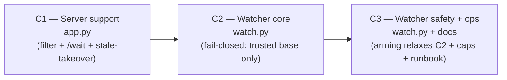

# Watcher delivery plan — 3 chunks, one feature-cycle each

Decomposition of the agent-watcher RFC (review `22c9555b3e`) into dependency-ordered chunks so `/feature-cycle` runs on each independently. This plan covers **how the work is split and sequenced**, not the design (the RFC is the design of record). Build does not start until this is approved.

## Goal

Ship the "auto-pick-up the handoff baton" watcher in increments that each **build, validate, and ship on their own**, in dependency order, so no chunk leaves the tree in a half-working or unsafe state.

## Context (what already shipped)

The `agent-handoff-baton` epic (PR #17, awaiting G8 merge) shipped the baton itself: `turn` (reviewer|agent) + `/handoff` endpoint + `agent_status` lease (owner + heartbeat `at`) + the viewer Send/reclaim UI + the `hand_back`/`ping_working` MCP tools. The watcher is the **automation on top**: a local `watch.py` that notices `turn==agent` and launches an agent session, so the human's "Send to agent" reaches a session with no human in the loop.

## The three chunks

### C1 — Server support (`svc`, `app.py`)

The detection + recovery primitives the watcher polls. Additive endpoints **plus one shipped-behavior change** (the stale-takeover, called out below). Ships in the existing service container; no watcher.

- `?turn=agent` filter on `GET /api/reviews` + default `turn` in `summary()` (so the list is the queue).
- `/wait` **long-poll** endpoint: a `threading.Condition` that the `/handoff` baton-flip `notify_all()`s, so a waiter returns immediately on a flip instead of busy-polling. Bounded server-side timeout; returns the changed review(s) or an empty timeout. **Wiring the ticket must pin:** the Condition wraps the existing global `_lock`, and the parked `wait(timeout)` *releases* `_lock` while blocked, or one parked `/wait` deadlocks every writer. **Thundering herd:** each `notify_all` wakes every waiter into the O(all-reviews) disk rescan `list_reviews()` already does, so either filter the wake to the changed id or accept and note the cost for the expected handful of waiters.
- **Stale-lease takeover** on the `{state:working}` arm of `/handoff`: grant the lease if the current owner is unset, equal, OR stale (`now − agent_status.at > TTL`). This **changes shipped baton behavior** for existing `ping_working` callers (a foreign owner can now take a stale lease), so it gets its own ticket and the G1 critic scrutinizes it on its own merits. The ticket must pin: (a) **TTL single source of truth** — the server arm's TTL and the viewer's `STALE_S=180` must not silently diverge; (b) the **reclaim-vs-takeover race** — a takeover must re-check `turn==agent` under the same `_lock` before granting (or the ticket states why a spawn against an already-reclaimed review is acceptable), so a reviewer reclaim concurrent with a takeover does not leave a credentialed spawn pointed at a review whose turn is already `reviewer`.

**Validation:** `py_compile` + curl. Filter returns only `turn==agent`. `/wait` blocks, returns on a flip in a second request, and times out cleanly. A live lease `409`s a foreign owner; a stale one is taken over. **Plus a ~20-line concurrent self-check** (the repo's one-runnable-check convention) that parks a `/wait` and fires a writer against it, proving the writer is not blocked — the lock-discipline failure mode the happy-path curl test misses.

**Depends on:** the baton (shipped).

### C2 — Watcher core (`watch.py`, fail-closed: trusted base only)

The working mechanism, **fail-closed**: it refuses to auto-run unless the configured base is trusted (a real check, not a doc note — default allow `localhost`/`127.0.0.1`, plus an explicit operator-set `WATCH_TRUSTED_BASE`). A credentialed process-spawner pointed at a public, no-auth base would let any URL-holder's "Send" trigger a launch, so the refusal lives **here**, in the chunk that introduces the spawner, not in C3.

- `watch.py` (sibling to `mcp_server.py`, stdlib-only: `urllib` + `subprocess` + `threading`): trusted-base check → long-poll C1's `/wait` → **claim-before-spawn** (atomic lease claim via `/handoff {state:working}`, spawn **only on 200**, so a cold start can't double-spawn) → spawn the launch command → the child env contract (`REVIEW_ID`, `MDREVIEW_BASE`, `owner`).
- **`WATCH_TRUSTED_BASE` is fail-closed:** it names a *specific* base by exact match (no wildcard); unset → loopback only; a value that doesn't match the actual `MDREVIEW_BASE` (typo) refuses rather than allows. Setting it is the operator *asserting* that remote base is access-controlled (proxy/token) — it is the "I vouch this is trusted" path. The "base is NOT trusted, but auto-run these specific reviews anyway" path is C3's arming, not this flag.
- **Minimal caps from day one** so it is never an unbounded spawner: a concurrency cap and a global launches/hour cap. **These bound a crash-loop's spend already** (a single non-converging review cannot exceed the global launches/hour), so the per-review attempt cap stays in C3 as a refinement, not an exposure control. (If C2 planning judges the global cap too coarse to ship the trusted-remote case safely, pull the per-review attempt cap up into C2 — flagged for that decision, default is C3.)

**Validation:** `py_compile` + an end-to-end run against a localhost throwaway instance using a **stub launch command** (a tiny script that `ping_working`s then `hand_back`s — no real `claude -p` needed): flip a baton → watcher claims → spawns the stub → baton returns to reviewer. A second watcher tick does not double-spawn. **Plus:** pointing the watcher at a non-trusted base (and at a base that mismatches `WATCH_TRUSTED_BASE`) refuses to start — the fail-closed check.

**Depends on:** C1.

### C3 — Watcher safety + ops (`watch.py` + docs, relaxes C2 for public use)

The layer that lets the watcher run against a **public / no-auth** instance, where provenance is not a trust boundary (anyone with the URL can comment and press Send). C3 **relaxes** C2's fail-closed refusal in a controlled way; it does not introduce the only guard.

- **Arming / allowlist:** an operator-controlled file (not API-settable, so a request can't arm itself) naming which reviews the watcher may auto-run. With arming configured, the watcher may run against a non-trusted base, but **only** for armed reviews; un-armed reviews are skipped even when `turn==agent`.
- **Per-review attempt cap + relaunch-convergence guard:** a crash-looping or non-converging review stops relaunching after N attempts (refines C2's global rate cap from "bounded total spend" to "no single review monopolizes the budget").
- **Runbook:** `CLAUDE.md` + README — how to run the watcher, the arming model, and the trusted-base / arming requirement.

**Validation:** against a non-trusted base, an un-armed review is skipped and an armed one runs; a crash-looping review is stopped by the attempt cap; the global rate cap holds.

**Depends on:** C2.

## Order and rationale

`C1 → C2 → C3`. C1 is additive endpoints plus the one isolated stale-takeover behavior change. **C2 is the mechanism and is safe on its own:** it fails closed, refusing any base it cannot trust, so the interim chunk cannot be pointed at a public instance. C3 *relaxes* that refusal for the untrusted-base case via operator arming, and adds the per-review crash-loop cap. The split maps onto the security model: **C2 = trusted-base mode, enforced by a real check**; **C3 = arming-gated untrusted-base mode**. Both modes ship, in order, and nothing in between is shippable-but-unsafe.

## Where the open RFC forks land

The RFC left three forks. This decomposition resolves or routes each:

| Fork | Resolution |
|---|---|
| **Build the daemon at all** (vs the session `/loop` baseline) | **Yes, build it** — the premise of this plan. The `/loop` baseline is no longer the path. |
| **Trust model** (trusted-instance vs per-review arming) | **Settled by the split:** C2 = fail-closed trusted-base mode, C3 adds arming to relax it. Not an either/or; both ship, sequenced. |
| **Launch mechanism** (`claude -p` vs generic command template) | **Decided at C2 planning.** Recommendation: a **generic command template** (default = Claude), so the watcher is not Claude-tied and the C2 test can use a stub command. |

## Risks / notes

- **C1's stale-takeover is the one behavior change to shipped code,** and it is not invisible: it changes what existing `ping_working` callers see a full cycle before any watcher exists. Isolated to its own ticket with the TTL-sync and reclaim-race items pinned above.
- **C2 ships a real, credentialed spawner.** Its safety is the fail-closed trusted-base refusal *in C2*, not a doc note — the RFC is explicit that documentation-gating is not a security control. The `WATCH_TRUSTED_BASE` escape hatch is the operator's vouching path (exact-match, fail-closed on mismatch); it does not weaken the loopback default. The concurrency + rate caps are in C2 too (bounding spend); only the per-review crash-loop cap and the arming-based relaxation are C3.
- **`watch.py` is not containerized.** Like `mcp_server.py`, it runs where the agent/operator runs, not inside the service container (it spawns local agent sessions and reads local creds). The Dockerfile is untouched.
- **Granularity option:** C1 can split into "detection (filter + `/wait`)" and "lease change (stale-takeover)" if a finer first cycle is wanted. Default is C1 as one cycle with two tickets.

## Out of scope

- Concurrent co-editing of one review by multiple agents (OT/CRDT) — deferred, issue #16.
- Any change to the baton contract itself (shipped in PR #17).
