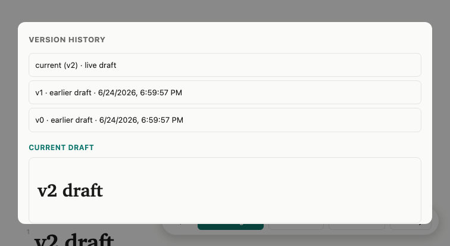

# MR-065 render evidence — History modal version labels

Branch: `MR-065-history-version-labels`. Date: 2026-06-24.

**The change verified** (`viewer.html` `openHistory()` / `showRound()`): the History modal now
lists the live draft as a top `current (vN)` entry ("live draft"), then archived rounds relabeled
`vN · earlier draft · {ts}` newest-first, with **no per-round notes count**. `openHistory()` fetches
both `GET /history` (rounds) and `GET /api/reviews/{id}` (for `revision`), and `showRound('current')`
auto-fills `#histview .histdoc` from `GET /source`. `showRound(n)` branches `n==='current'` (→ `/source`)
vs a round number (→ `/history/{n}`).

The modal is `display:none` and populated only by a `#histbtn` click → async `openHistory()`, so a
static `--dump-dom` render-smoke cannot reach it. Driven instead with a **node-CDP driver**
(`.scratch/hist-verify.mjs`, Node built-in `WebSocket` over the Chrome DevTools Protocol,
`Runtime.evaluate{returnByValue,awaitPromise}` — the repo's `agent_smoke.py` pattern).

## Environment

- `docker build -t mdreview-mr065-smoke .` — succeeded.
- Disposable container on **scratch port 8770** (`-e MDREVIEW_DATA=/data`); `/healthz` returned `{"ok": true}`.
- Headless Chrome 149.0.7827.156, `--remote-debugging-port=9333` (scratch debug port).
- Node v22.22.0 (global `WebSocket`).

## Fixture

POST `# v0 draft` → PUT `# v1 draft` → PUT `# v2 draft` (revision=2, rounds [1,0]) +
one reviewer comment (proves the modal shows NO "0 notes" even with feedback present).
Confirmed via API: `revision=2`, `history.rounds=[1,0]`, `source="# v2 draft"`, 1 open comment.

## Results — PASS/FAIL per check

| Check | Result |
|---|---|
| `docker build` | **PASS** |
| `/healthz` reachable | **PASS** |
| 3 histitems (current + v1 + v0) | **PASS** |
| top = `current (v2) · live draft` | **PASS** |
| archived v1 + v0, each "earlier draft", newest-first (v1 before v0) | **PASS** |
| no notes text anywhere in modal | **PASS** |
| current draft auto-shown = v2 | **PASS** |
| badge reconciles (`revision==2` & top contains `v2`) | **PASS** |
| archived-click (v1) shows "v1 draft" | **PASS** |
| `#histbtn` renders (static render-smoke) | **PASS** |

`scripts/render-smoke.sh http://localhost:8770/review/<id> '#histbtn'` → `ok : #histbtn (1 node)`, exit 0.

node-CDP driver exit code: **0** (all 10 assertions pass).

## node-CDP assertion JSON

```json
{
  "histitemCount": 3,
  "topText": "current (v2) · live draft",
  "archivedLabels": [
    "v1 · earlier draft · 6/24/2026, 6:59:57 PM",
    "v0 · earlier draft · 6/24/2026, 6:59:57 PM"
  ],
  "noNotesText": true,
  "currentDraftShown": true,
  "metaRevision": 2,
  "badgeReconciles": true,
  "screenshot": ".scratch/history-modal.png",
  "archivedClickShowsV1": true,
  "checks": [
    { "name": "histitemCount==3", "pass": true },
    { "name": "top starts with \"current (v2)\"", "pass": true },
    { "name": "top contains \"live draft\"", "pass": true },
    { "name": "archived has v1 (earlier draft)", "pass": true },
    { "name": "archived has v0 (earlier draft)", "pass": true },
    { "name": "newest-first: v1 before v0", "pass": true },
    { "name": "no notes text in modal", "pass": true },
    { "name": "current draft shown = v2", "pass": true },
    { "name": "badge reconciles (rev==2 & top has v2)", "pass": true },
    { "name": "archived-click shows v1 draft", "pass": true }
  ]
}
```

## Screenshot

The open modal with the current draft auto-shown: `current (v2) · live draft` top entry, archived
`v1`/`v0` "earlier draft" rounds newest-first, no notes count, "CURRENT DRAFT" → "v2 draft".


