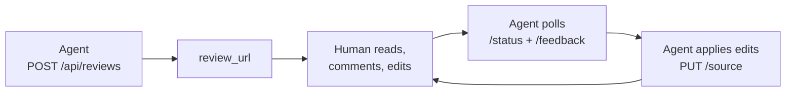

# mdreview

**Human-in-the-loop markdown review for AI agents.** An agent POSTs a markdown draft over HTTP,
hands the returned URL to a human, and polls the feedback back. One running service handles any
number of reviews, each isolated by an opaque `id` — no per-process spawning, no shared filesystem
with the agent.

It's the missing "let a human read this before you act" step: a plan, a design doc, an RFC, or any
draft an agent produces gets a real review surface — inline comments, a turn baton, live reload —
instead of being pasted into a chat window.



## Start here

- **[Quickstart](#/quickstart)** — run an instance and walk the POST → review → poll → update loop.
- **[Guide](#/guide)** — rich content (math, diagrams, images), threaded comments, the turn baton,
  the MCP server, and self-hosting.
- **[Troubleshooting](#/troubleshooting)** — the handful of footguns and their fixes.

For the exhaustive API table, every env var, and the watcher runbook, see the
[project README](https://github.com/waqaskhan137/mdreview-service#readme) — these docs link to it
rather than duplicate it.

## What you get

- **Renders like it publishes.** The viewer renders markdown the way a Jekyll/MathJax site does:
  LaTeX math, ` ```mermaid ` diagrams, GFM footnotes, and syntax-highlighted code — so a
  math- or diagram-heavy draft reviews as it will ship. (This very page is rendered by the same
  engine.)
- **Threaded comments.** A reviewer highlights text and starts a thread; the agent replies or
  resolves it, with an `open → resolved → reopened` state machine enforced server-side.
- **A turn baton.** An explicit "your move" hand-off between the human and the agent, so a review
  is a back-and-forth workspace, not a one-shot paste.
- **Stdlib-only and self-contained.** A tiny Python image with no pip installs; the renderers are
  vendored and served locally, so the browser needs no CDN.
